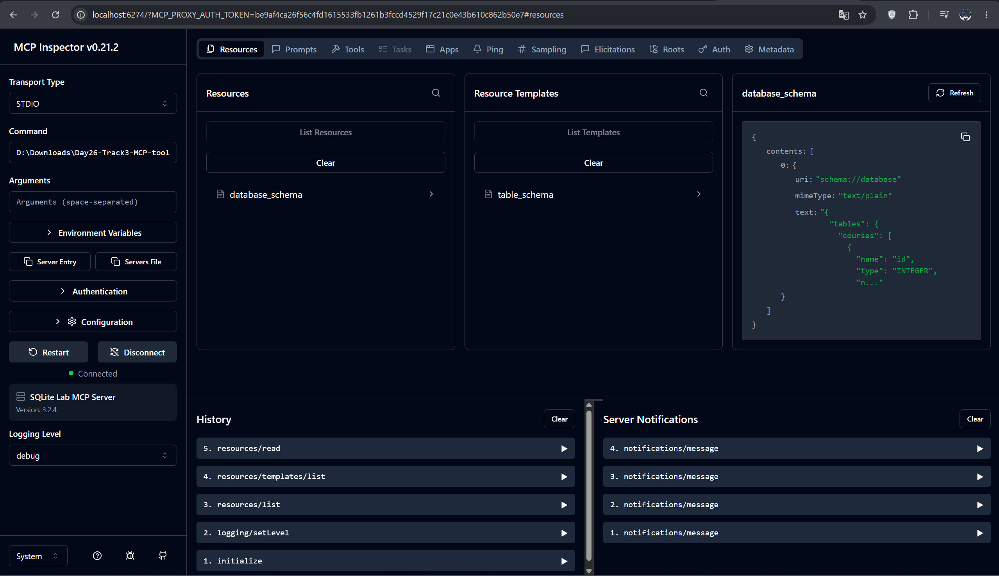
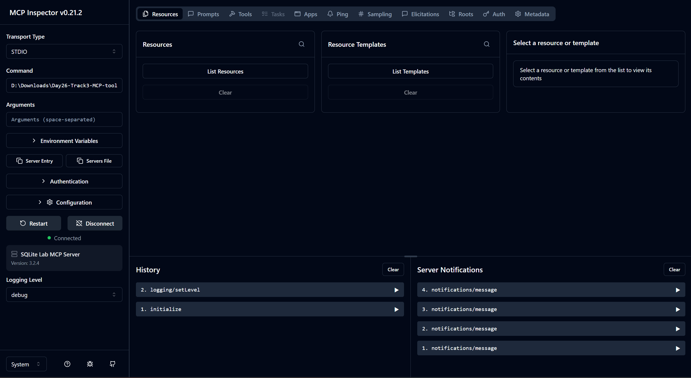
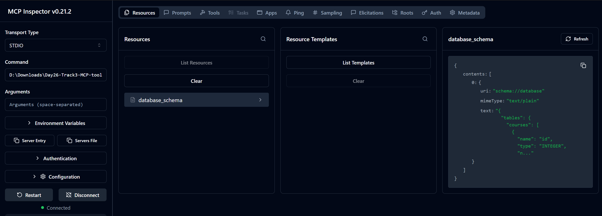
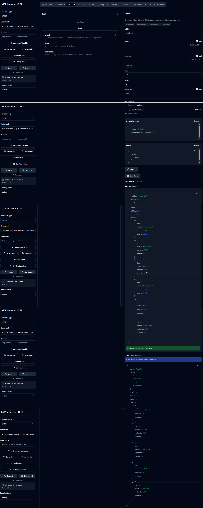
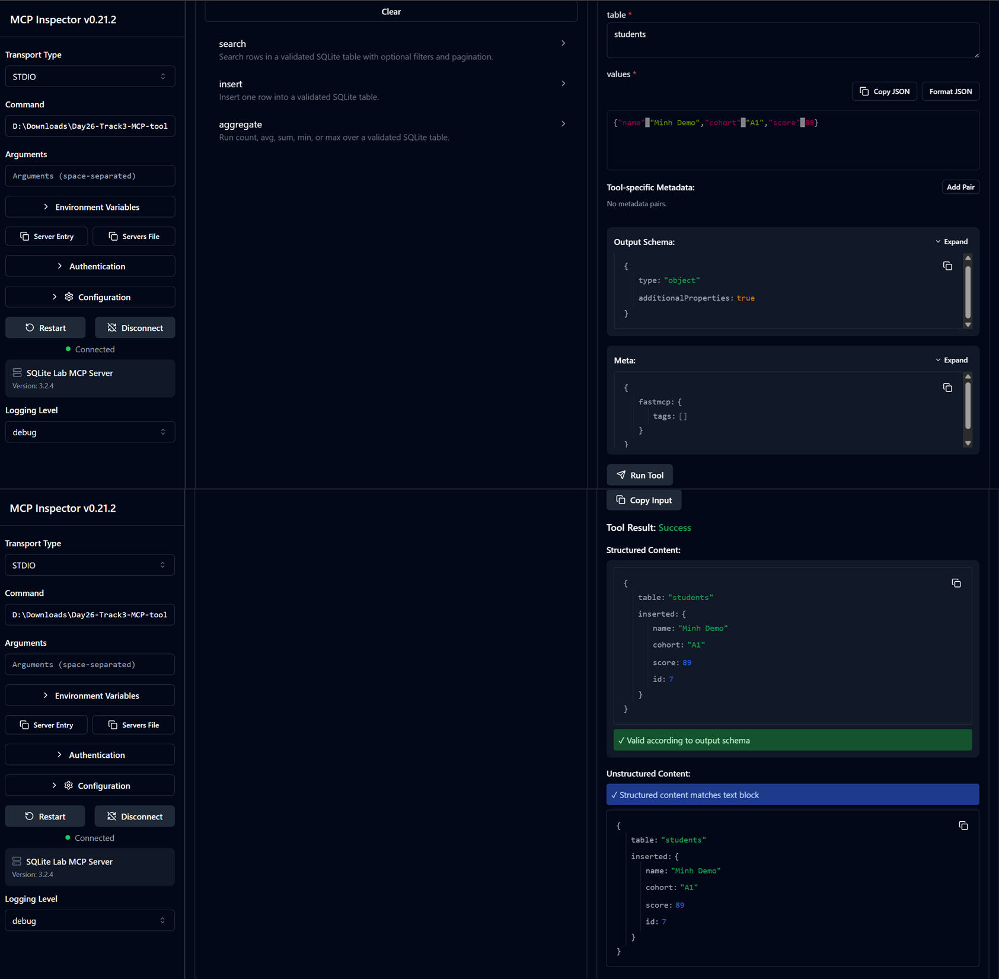
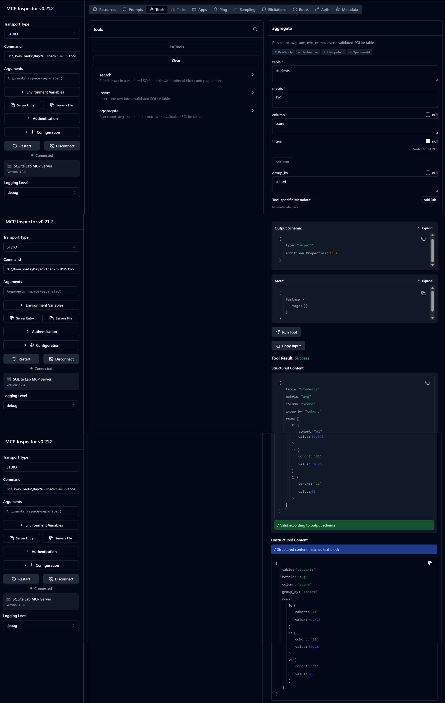
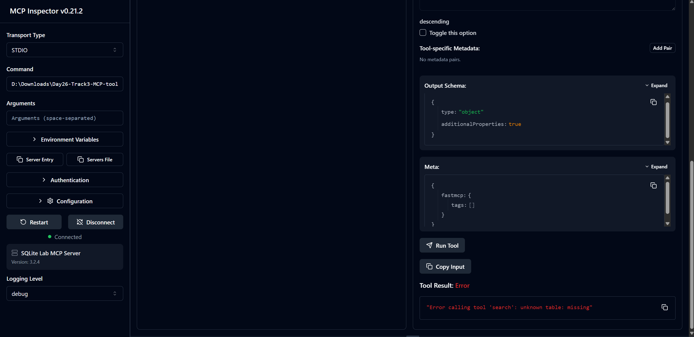
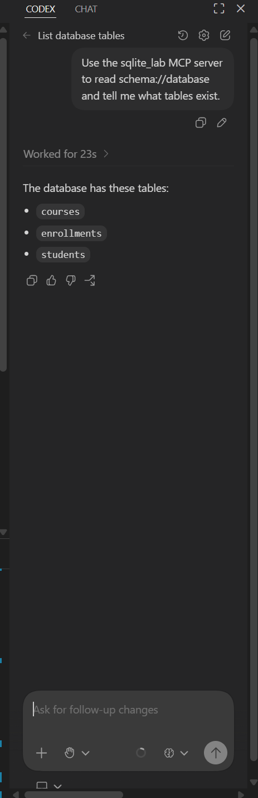

# Báo Cáo Lab Day26 - MCP Tool Integration

## 1. Thông Tin Lab

- **Tên lab:** Build a Database MCP Server with FastMCP and SQLite
- **Công nghệ sử dụng:** Python, FastMCP, SQLite, MCP Inspector
- **Thư mục triển khai:** `implementation/`
- **Database:** `implementation/school.db`
- **MCP server:** `implementation/mcp_server.py`

## 2. Mục Tiêu

Mục tiêu của lab là xây dựng một MCP server bằng FastMCP để kết nối với SQLite database. Server cần cung cấp 3 tool chính:

- `search`: tìm kiếm dữ liệu trong bảng.
- `insert`: thêm một record mới vào bảng.
- `aggregate`: tính toán thống kê như `count`, `avg`, `sum`, `min`, `max`.

Ngoài ra, server cũng cần expose schema của database thông qua MCP resources:

- `schema://database`
- `schema://table/{table_name}`

## 3. Cấu Trúc Project

```text
Day26-Track3-MCP-tool-integration/
  implementation/
    db.py
    init_db.py
    mcp_server.py
    verify_server.py
    school.db
    tests/
      test_db.py
  requirements.txt
  run_mcp_server.cmd
  REPORT.md
```

Trong đó:

- `db.py`: chứa database adapter, logic validate input và các hàm `search`, `insert`, `aggregate`.
- `init_db.py`: tạo SQLite database và seed dữ liệu mẫu.
- `mcp_server.py`: tạo FastMCP server, đăng ký tools và resources.
- `verify_server.py`: script kiểm tra nhanh các chức năng chính.
- `tests/test_db.py`: automated tests cho database layer.
- `run_mcp_server.cmd`: file wrapper giúp MCP Inspector chạy đúng Python environment và đúng server script.

## 4. Database Schema

Database gồm 3 bảng:

- `students`: lưu thông tin học viên.
- `courses`: lưu thông tin khóa học.
- `enrollments`: lưu thông tin đăng ký khóa học.

Schema được expose qua MCP resource `schema://database`. Khi kiểm tra trong MCP Inspector, resource trả về danh sách các bảng và cột tương ứng.

**Ảnh minh họa schema resource:**



## 5. Cách Chạy Project

### 5.1. Cài dependencies

```powershell
cd D:\Downloads\Day26-Track3-MCP-tool-integration
.\.venv\Scripts\python.exe -m pip install -r requirements.txt
```

### 5.2. Khởi tạo database

```powershell
.\.venv\Scripts\python.exe .\implementation\init_db.py
```

### 5.3. Chạy verification script

```powershell
.\.venv\Scripts\python.exe .\implementation\verify_server.py
```

Kết quả mong đợi:

- Liệt kê được các bảng trong database.
- Search được học viên thuộc cohort `A1`.
- Insert được học viên mới.
- Aggregate được điểm trung bình theo cohort.
- Bắt được lỗi khi search bảng không tồn tại.

### 5.4. Chạy MCP Inspector

```powershell
npx -y @modelcontextprotocol/inspector
```

Cấu hình trong MCP Inspector:

```text
Transport Type: STDIO
Command: D:\Downloads\Day26-Track3-MCP-tool-integration\run_mcp_server.cmd
Arguments: để trống
```

Sau đó bấm **Connect** để kết nối tới MCP server.

**Ảnh MCP Inspector kết nối thành công:**



## 6. MCP Resources

Server expose các resource sau:

| Resource | Mô tả |
|---|---|
| `schema://database` | Trả về toàn bộ schema của database |
| `schema://table/{table_name}` | Trả về schema của một bảng cụ thể |

Trong MCP Inspector, resource `schema://database` được dùng để kiểm tra schema của database. Kết quả cho thấy database có các bảng `students`, `courses` và `enrollments`.

## 7. MCP Tools

Server expose 3 tools:

| Tool | Mô tả |
|---|---|
| `search` | Tìm kiếm rows trong bảng với filters, ordering và pagination |
| `insert` | Thêm một row mới vào bảng |
| `aggregate` | Tính metric `count`, `avg`, `sum`, `min`, `max` |

**Ảnh danh sách tools trong MCP Inspector:**



## 8. Kiểm Thử Tool `search`

Input:

```json
{
  "table": "students",
  "filters": [
    {
      "column": "cohort",
      "op": "=",
      "value": "A1"
    }
  ],
  "order_by": "score",
  "descending": true,
  "limit": 5,
  "offset": 0
}
```

Kết quả:

- Tool trả về danh sách học viên thuộc cohort `A1`.
- Kết quả được sắp xếp theo `score` giảm dần.

**Ảnh tool `search` chạy thành công:**



## 9. Kiểm Thử Tool `insert`

Input:

```json
{
  "table": "students",
  "values": {
    "name": "Minh Demo",
    "cohort": "A1",
    "score": 89
  }
}
```

Kết quả:

- Tool insert thành công một student mới.
- Output có object `inserted`.
- Nếu table có cột `id`, server trả về thêm `id` của record vừa insert.

**Ảnh tool `insert` chạy thành công:**



## 10. Kiểm Thử Tool `aggregate`

Input:

```json
{
  "table": "students",
  "metric": "avg",
  "column": "score",
  "group_by": "cohort"
}
```

Kết quả:

- Tool tính điểm trung bình của cột `score`.
- Kết quả được group theo `cohort`.

**Ảnh tool `aggregate` chạy thành công:**



## 11. Kiểm Thử Validation Và Error Handling

Server có validation để chặn request không hợp lệ:

- Table không tồn tại.
- Column không tồn tại.
- Operator không được hỗ trợ.
- Insert rỗng.
- Aggregate request không hợp lệ.

Ví dụ request sai:

```json
{
  "table": "missing_table"
}
```

Kết quả mong đợi:

```text
unknown table: missing_table
```

**Ảnh validation error:**



## 12. Kiểm Thử Bằng Codex Client

Ngoài MCP Inspector, server cũng được kiểm thử bằng Codex client. Codex được cấu hình để sử dụng MCP server `sqlite_lab`, sau đó đọc resource `schema://database` để lấy thông tin schema.

Prompt sử dụng:

```text
Use the sqlite_lab MCP server to read schema://database and tell me what tables exist.
```

Kết quả Codex trả về danh sách các bảng trong database:

- `courses`
- `enrollments`
- `students`

Điều này chứng minh MCP server có thể được sử dụng từ một MCP client thực tế, không chỉ từ MCP Inspector.

**Ảnh kiểm thử bằng Codex client:**



## 13. Đánh Giá Theo Rubric

| Tiêu chí | Kết quả |
|---|---|
| FastMCP server start thành công | Đạt |
| SQLite database có schema và seed data | Đạt |
| Tool `search` hoạt động | Đạt |
| Tool `insert` hoạt động | Đạt |
| Tool `aggregate` hoạt động | Đạt |
| Full database schema resource | Đạt |
| Per-table schema resource template | Đạt |
| Validation và error handling | Đạt |
| Test bằng MCP Inspector | Đạt |
| Có client configuration/example | Đạt |
| Kiểm thử bằng MCP client thực tế | Đạt |

## 14. Kết Luận

Lab đã hoàn thành việc xây dựng MCP server sử dụng FastMCP và SQLite. Server expose được 3 tools bắt buộc là `search`, `insert`, `aggregate`, đồng thời expose database schema thông qua MCP resources. Kết quả test trên MCP Inspector cho thấy server kết nối thành công, resources và tools discover được, các tool chạy đúng với input hợp lệ, và server trả lỗi rõ ràng với input không hợp lệ.
